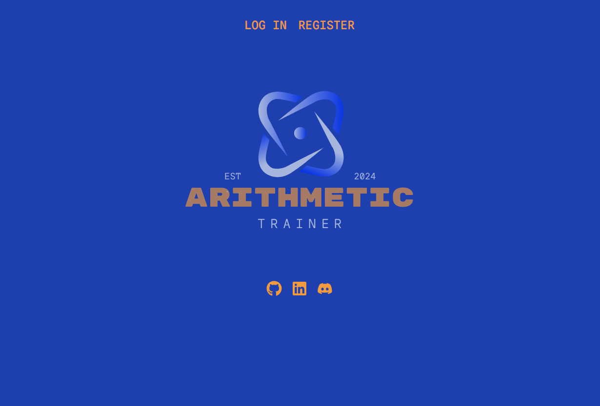
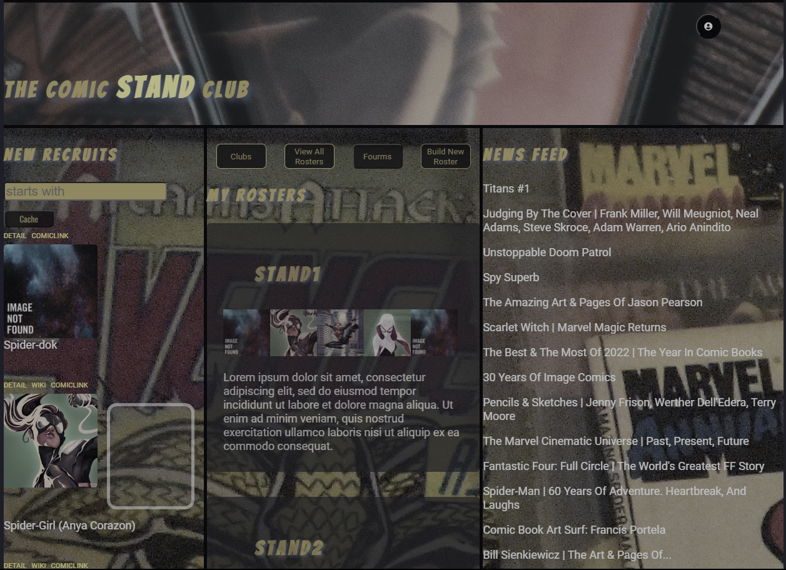
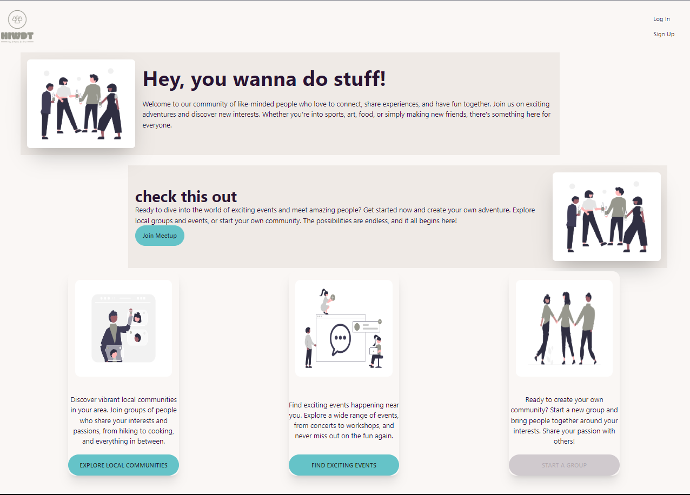

<h1></h1>

<h2>
✨
<a href="https://rajahwu.github.io/">@rajahwu</a>
✨
</h2>

<h2>

🌐 Web Developer | 🚀 Software Engineer | 🤖 Tech Enthusiast

</h2>

---

⚛️ React | 🐍 Python | 🌐 HTML | 🎨 CSS | 📚 SQL | 🌲 Git | 🟢 Node.js

---

Studied at App Accademy

## Projects

### Current Project

#### [Arithmetic Trainer](https://github.com/rajahwu/arithmetic-trainer)

### [The Comic Stand Club](https://the-comic-stand-club.onrender.com)

[live](https://the-comic-stand-club.onrender.com/) | [github](https://github.com/rajahwu/the_comic_stand_club)

### [Hey, I Wanna Do That](https://meetup-clone-yhrq.onrender.com)

[live](https://meetup-clone-yhrq.onrender.com) | [gitgub](https://github.com/rajahwu/meetup_clone)

## About Me

---

Ever since I discovered the world of coding, I realized that I had always been in love with it. It was a revelation that came to me once I found the tools and resources to learn programming. The moment I started delving into coding, I felt a deep sense of fulfillment and excitement that I had been missing all along.

One of my favorite projects that truly captured my passion for coding was [Catsagarm 2](https://quiet-queijadas-6066de.netlify.app/). I initially built this app using vanilla JavaScript, but later, I decided to take it a step further. I upgraded the project by incorporating jQuery and TypeScript. Witnessing the progress and growth I experienced as a developer throughout this project was truly remarkable. It showcased to me just how far I could push myself and the incredible possibilities that coding offered.

Currently, I am focused on sharpening my skills in TypeScript for JavaScript and exploring automation and testing using Python. These new skills not only expand my knowledge but also empower me to create more robust and efficient code. In the near future, I plan to dive into learning PHP to widen my language repertoire and explore new avenues in web development.

Outside of coding, I have a passion for other creative endeavors. Drawing and doodling have always been a way for me to express myself visually and unleash my imagination. It's a wonderful outlet that allows me to relax and bring my ideas to life on paper. Additionally, I have a keen interest in audio production. Being able to combine my coding skills with music and sound design opens up exciting possibilities for me to create unique and immersive experiences.

Coding has become an integral part of who I am, driving my curiosity and passion to constantly learn and explore new technologies. It provides me with the ultimate creative outlet and fuels my desire to solve problems and bring ideas to life. With each new project and skill I acquire, I am reminded of the infinite potential and growth that coding offers. It's a journey that I am deeply committed to, and I look forward to the endless possibilities that lie ahead.
